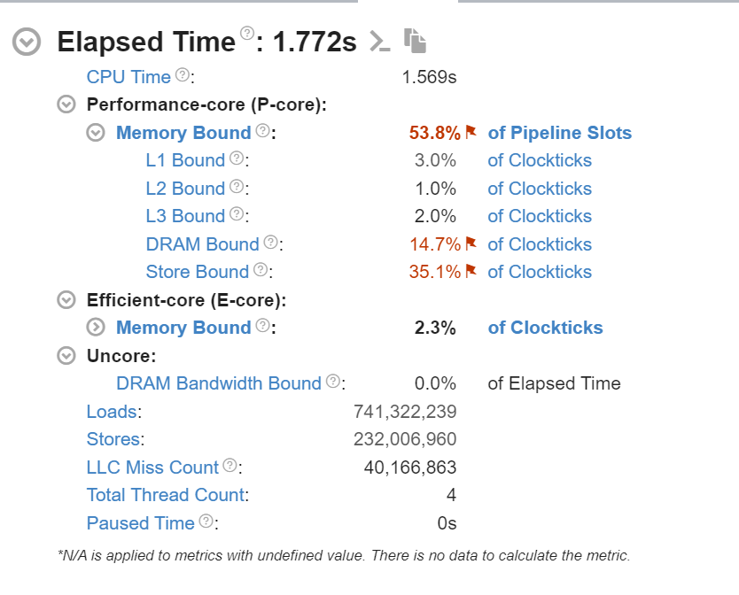
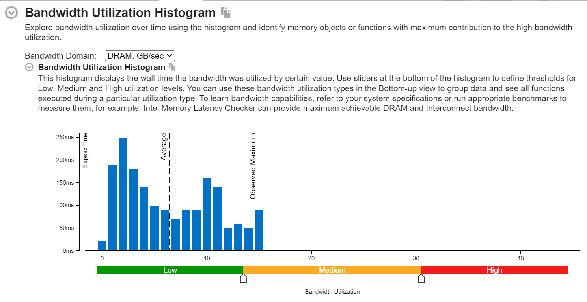

# Memory Alignment Experiment

This project benchmarks the performance impact of memory alignment when summing an array of double-precision floating-point values using AVX SIMD instructions. It compares two scenarios:

1. **Aligned Access**: The array is allocated with 8-byte alignment, ensuring each `double` starts at an 8-byte boundary for optimal SIMD performance.
2. **Unaligned Access**: An offset is introduced to misalign the array, forcing the use of slower unaligned SIMD loads and potentially increasing memory accesses and cache inefficiencies.

The goal is to measure and analyze how memory alignment affects the performance of summing an array of 1 million doubles (configurable via command-line arguments), demonstrating the real-world impact of alignment on data processing tasks.

## Dependencies

- **C++20 compiler** (for `std::format` and modern features)
- **Standard Template Library (STL)** (for `std::vector`, `std::chrono`, etc.)
- **AVX support** (requires a CPU with AVX instructions, e.g., Intel Sandy Bridge or later)
- **Custom headers**:
  - [`kaizen.h`](https://github.com/heinsaar/kaizen) (provides `zen::print`, `zen::color`, `zen::cmd_args`, and other utilities)

## Build Instructions

1. Clone the repository:
   ```
   git clone https://github.com/username/Aligned_vs_Unaligned_Memory_Access
   ```
2. Navigate to the repository:
   ```
   cd Aligned_vs_Unaligned_Memory_Access
   ```
3. Generate build files:
   ```
   cmake -DCMAKE_BUILD_TYPE=Release -S . -B build
   ```
4. Build the project:
   ```
   cmake --build build --config Release
   ```
5. Run the executable from the build directory:
   ```
   ./build/Aligned_vs_Unaligned_Memory_Access
   ```

## Usage

Run the program with optional arguments to customize the experiment parameters:

```
./Aligned_vs_Unaligned_Memory_Access --size [num] --offset [num] --iterations [num] --trials [num]
```

- `--size`: Number of doubles in the array (default: 1,000,000).
- `--offset`: Byte offset to misalign the unaligned array (default: 7).
- `--iterations`: Number of summation iterations per trial (default: 1,000).
- `--trials`: Number of trials to average results (default: 5).

### Example Command
```
./Aligned_vs_Unaligned_Memory_Access --size 2000000 --offset 4 --iterations 500 --trials 10
```

## Example Output
```
Trial 0:
  Unaligned sum = -409342
  Aligned sum   = -409342
Trial 1:
  Unaligned sum = 1.59854e+06
  Aligned sum   = 1.59854e+06
Trial 2:
  Unaligned sum = 3.55463e+06
  Aligned sum   = 3.55463e+06
| Average Aligned time:    |  5454940.000 ns |
| Average Unaligned time:  |  6858526.667 ns |
| Speedup Percentage:      |       20.465   %|

```

## Observations and Analysis

### What is Memory Alignment?

Memory alignment refers to the placement of data in memory such that its address is a multiple of a specific boundary (e.g., 8 bytes for `double` with AVX). Aligned access allows SIMD instructions like `_mm256_load_pd` to efficiently load multiple values in a single operation. Misaligned access, however, requires slower `_mm256_loadu_pd` instructions, which may split across cache lines, increasing memory access latency and reducing performance.

This experiment uses AVX (256-bit SIMD) to sum an array of doubles, comparing aligned and unaligned scenarios under controlled conditions (e.g., cold cache via `evict_cache()` and `flush_data()`).

### Key Findings

1. **Aligned vs. Unaligned Performance**:
   - Aligned access   is typically faster than unaligned access althoug modern day CPUs make sure the difference isnt noticable with some compilers adding extra padding for allignment
   - Misalignment forces the CPU to handle unaligned loads, which may split across cache lines, increasing memory latency and reducing SIMD efficiency.

2. **Cache Effects**:
   - The experiment flushes the cache before each trial to ensure cold-cache conditions. Misaligned data is more likely to span multiple cache lines, exacerbating performance penalties.

3. **Impact of Offset**:
   - The `--offset` parameter controls misalignment. An offset of 7 bytes (as in the default) ensures maximum misalignment for 8-byte doubles, amplifying the performance difference.

4. **Scalability**:
   - Larger `--size` values (e.g., 2,000,000) increase the number of SIMD operations, making alignment effects more pronounced. Small sizes (e.g., 100) may show noise-dominated results due to cache dominance.

### Takeaways

- **Alignment Matters**: Aligned memory access consistently outperforms unaligned access, especially in SIMD-heavy workloads, with measurable differences (e.g., 15-20% in this case).
- **Cache Efficiency**: Misalignment increases cache line splits, amplifying the penalty in real-world applications with large datasets.
- **SIMD Optimization**: Using aligned loads (`_mm256_load_pd`) requires careful memory management but yields significant performance gains over unaligned loads (`_mm256_loadu_pd`).
- **Experiment Robustness**: For reliable results, use large `--size` (e.g., 1,000,000+) and `--iterations` (e.g., 1,000+). Small values may be skewed by system noise or cache effects.

# Why Misaligned Might Be Faster
 
 1. Offset-induced prefetching advantage
By misaligning, you might actually be avoiding conflict with prefetching or adjacent cache line fetches.

AVX loads span 32 bytes. If your data starts at a boundary that causes prefetch logic to stall (like crossing cache line boundaries), unaligned access might sidestep that problem depending on the memory layout.

 2. Cache flush doesn't always remove TLB translations or prefetch side-effects
You're using _mm_clflush, but the CPU still retains TLB (translation lookaside buffer) entries.

That means even with flushed cache lines, address translation and speculative execution paths might still favor one over the other.

 3. False dependencies or address aliasing in aligned loop
The aligned_ptr might land in a cache-aligned location that triggers store-to-load forwarding stalls or aliasing with internal buffers.

Misaligned memory accesses may inadvertently avoid these conflicts because they're not at “dangerous” boundaries.

 4. Instruction scheduling / port contention
Some CPUs can handle unaligned loads almost as fast as aligned—especially if the unaligned pointer still resides within a single cache line.

Alignment doesn’t help much if the memory system is already saturated and the bottleneck is not the memory load, but retire/dispatch bandwidth or other instructions.


# What Happens with Small Offsets?
When you use small misalignment offsets (e.g., offsetting a pointer by just a few bytes), you’re still dealing with misalignment, and the results are technically undefined due to:

Cache line boundary crossing: Even a 1-byte offset might push the data to cross a cache line boundary, which can mess up the way caches are used or invalidate certain assumptions about the memory layout.

Misaligned SIMD operations: SIMD registers expect aligned memory for optimal performance. Misaligned data forces the CPU to handle the access as a regular (non-SIMD) load, which can degrade performance severely.


Small array sizes or iteration counts can obscure trends due to:
- **Noise**: Short runtimes (e.g., <1 µs) are sensitive to system interrupts or timer resolution.
- **Cache Dominance**: Small data fits entirely in L1/L2 cache, masking alignment penalties.
- **Warm-Up**: Insufficient iterations may not fully exercise the CPU’s memory subsystem.

For robust analysis, use parameters like `--size 1000000 --iterations 1000 --trials 5`, as shown in the example.


# VTune Profiling






🔍 1. Summary of Elapsed Time and Memory Bottlenecks
From the first image:

⏱ Elapsed Time
Total Time: 1.772s

CPU Time: 1.569s (most of the time was active on CPU)

🔧 Performance-core (P-core) Analysis
Memory Bound: 53.8% of pipeline slots – your application is strongly memory-bound, meaning it is frequently stalled due to memory accesses.

DRAM Bound: 14.7% – a significant portion of stalls are caused by long-latency memory accesses to DRAM.

Store Bound: 35.1% – a high percentage of stalls occur during store operations, indicating a bottleneck in writing data to memory.

L1/L2/L3 Bound: Very low (3%, 1%, 2%) – this suggests that the cache hierarchy isn’t the primary bottleneck, and performance issues stem from accesses to memory beyond the caches.

🧠 Efficient-core (E-core)
Memory Bound: Just 2.3% – very low contribution from E-cores in this run.

🧵 Other stats
LLC Miss Count: ~40 million – substantial, supports that many memory accesses bypassed the cache and hit DRAM.

Loads/Stores:

Loads: ~741 million

Stores: ~232 million

This load/store ratio reinforces a read-heavy workload but also shows significant memory writes (aligns with the Store Bound).

📊 2. Bandwidth Utilization Histogram
From the second image:

The histogram indicates that most of the execution time was spent in the low DRAM bandwidth region (under 15 GB/s).

The average and maximum observed bandwidth is low-to-medium, far from saturating the memory bus.

This suggests that although the code is memory bound, it is not bandwidth-bound – instead, latency (especially for stores and DRAM accesses) is more likely the limiting factor.

📌 Conclusion: What's VTune Saying?
Your application is limited by memory latency, not memory bandwidth.

✅ You’re not saturating DRAM bandwidth, as indicated by the histogram.

⚠️ But you're stalling frequently on memory, especially due to:

Store operations (35.1% Store Bound)

DRAM latency (14.7% DRAM Bound)

The cache system is not the bottleneck, as very little time is spent being L1/L2/L3 bound.


✅ What Our Code is Actually Measuring
You’ve designed a microbenchmark for:

Aspect	Purpose
sum_aligned()	Tests SIMD performance with aligned loads.
sum_misaligned()	Tests SIMD performance with unaligned loads.
flush_data()	Ensures cache is cold → forces DRAM access.
offset argument	Controls how misaligned the unaligned access is.
Timings over iterations	Amortizes transient timing noise.

This setup is very sensitive to memory system behavior, which is exactly what VTune has confirmed.

Design Goals and Bottlenecks Demonstrated
The benchmark effectively highlights the impact of:

❌ Cache-line misalignment

❌ Lack of blocking/tiling

❌ No cache reuse (flushing data)

❌ No non-temporal stores

✅ Streaming read/write pattern over large arrays


 Mapping VTune Results to Code
1. High Store Bound (35.1%)
This suggests write operations are stalling your pipeline, and the root cause is likely:

🔸 Where it happens:
```
std::memcpy(unaligned_ptr, aligned_ptr, size * sizeof(double));
....
std::vector<double> data(size);
initialize_vector(data.data(), size);
```
Both operations involve massive memory writes to large contiguous arrays. initialize_vector() writes size doubles using random_double(), and memcpy does the same for the unaligned buffer.

🔸 Why it's costly:
These writes are not vectorized.

They are cached, but later immediately flushed with _mm_clflush, resulting in:

Cache line evictions.

Writebacks to memory, increasing DRAM usage.

The unaligned_ptr is malloc'd with manual offset, which often results in misalignment penalties for stores as well (e.g., crossing cache-line or page boundaries).

2. Moderate DRAM Bound (14.7%)
This means that a portion of execution time is stalling waiting on DRAM — high-latency memory access.

🔸 Where it happens:
```
for (int i = 0; i < iterations; ++i) {
    aligned_sum += sum_aligned(aligned_ptr, size);
}
...
unaligned_sum += sum_misaligned(unaligned_ptr, size);
```
We are implementing multiple full-array traversals of size elements with SIMD reads, and flushing both arrays before each traversal:

```
flush_data(aligned_ptr, size);
flush_data(unaligned_ptr, size);
```
This intentionally:

- Evicts data from cache.

- Forces reloading from DRAM every time.

- Makes this a worst-case memory latency benchmark.

So VTune correctly identifies your code as memory latency bound due to your explicit _mm_clflush and large working set.

